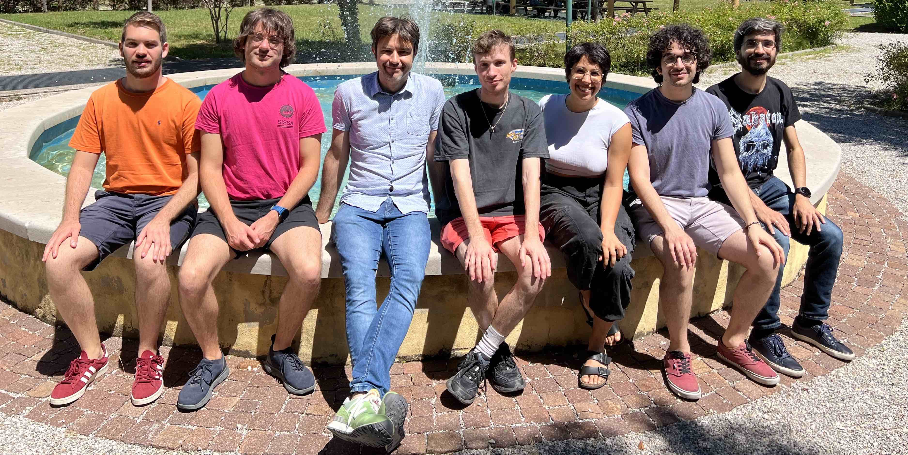

  <button class="tab-button active" data-tab="current" onclick="filterPeople('current')">Current</button>
  <button class="tab-button" data-tab="guest" onclick="filterPeople('guest')">Guests</button>
  <button class="tab-button" data-tab="previous" onclick="filterPeople('previous')">Previous</button>

  
  

    

      
      
      
    

    

      <h3>{{ person.name }}</h3>
      
Previous Member, {{ person.role }}

      
      
Funded by: {{ person.funds }}

      
      
      
Funded by: SISSA

      
      

        
{{ person.previously | markdownify }}
 
        {{ person.research | markdownify }}
      

      

        
        <a href="mailto:{{ person.email }}" target="_blank" aria-label="Email" title="Email"><i class="fas fa-envelope"></i></a>
        
        
        <a href="tel:{{ person.phone }}" target="_blank" aria-label="Phone" title="Phone"><i class="fas fa-phone"></i></a>
        
        
        <a href="{{ person.thesis }}" target="_blank" aria-label="PhD Thesis" title="PhD Thesis"><i class="fas fa-book"></i></a>
        
        
        <a href="https://orcid.org/{{ person.orcid }}" target="_blank" aria-label="ORCID" title="ORCID"><i class="fab fa-orcid"></i></a>
        
        
        <a href="{{ person.scholar }}" target="_blank" aria-label="Google Scholar" title="Google Scholar"><i class="fas fa-graduation-cap"></i></a>
        
        
        <a href="https://prereview.org/profiles/{{ person.orcid }}" target="_blank" aria-label="PREreview" title="PREreview"><i class="fas fa-clipboard"></i></a>
        
        
        <a href="{{ person.bluesky }}" target="_blank" aria-label="Bluesky" title="Bluesky"><i class="fab fa-bluesky"></i></a>
        
        
        <a href="{{ person.twitter }}" target="_blank" aria-label="Twitter/X" title="Twitter/X"><i class="fab fa-x-twitter"></i></a>
        
        
        <a href="{{ person.linkedin }}" target="_blank" aria-label="LinkedIn" title="LinkedIn"><i class="fab fa-linkedin"></i></a>
        
        
        <a href="{{ person.github }}" target="_blank" aria-label="GitHub" title="GitHub"><i class="fab fa-github"></i></a>
        
      

    

  

  

